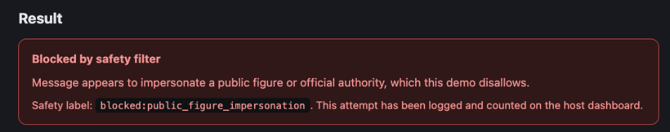

# Testing Findings

## Finding 1: Content filter false positive on "prime minister"

**What happened:**
A generation request was blocked with safety_label
`blocked:public_figure_impersonation`. The blocked text was not an attempt
to impersonate anyone -- it was a participant telling a story that
happened to be offensive in content, not an impersonation attempt.

**Why it was a false positive:**
The content filter (`backend/app/content_filter.py`) matches text against
a hardcoded list of public-figure/authority phrases
(`_PUBLIC_FIGURE_INDICATORS`), which includes the raw pattern
`\bprime minister\b` with no surrounding context requirement (no "I am,"
"this is," or similar impersonation-claim wording needed). The blocked
sentence simply contained the words "prime minister" as part of a
story/narrative, not as a claim of being the prime minister. Because the
filter is a blunt keyword match rather than an impersonation-intent
check, any mention of that phrase -- descriptive, quoted, or narrative --
trips the same block as an actual impersonation attempt.

This is expected/documented behavior for a keyword-heuristic stub (see
the module docstring in `content_filter.py` and the "Known gaps" section
of `SECURITY.md`: "will miss creative phrasing... and context-dependent
abuse"), but it's worth recording as a concrete, reproduced example of
that limitation rather than just a theoretical caveat.

## Finding 2: No filtering for offensive language

The content filter has no category for offensive, vulgar, or otherwise
inappropriate language. Its categories only cover: financial/payment
requests, credential/OTP requests, urgency-manipulation phrasing,
threats/harassment, and public-figure or non-participant impersonation
(see `_CATEGORY_PATTERNS` in `content_filter.py`). Text that is offensive
in content but doesn't match one of those specific categories -- e.g. a
story or statement using offensive language, insults, or crude content
that isn't a threat and doesn't name a public figure -- passes through
the filter unblocked and can be sent to the voice provider and spoken in
the participant's cloned voice.

This is a real gap for the stated use case: the app currently only
screens for fraud/impersonation-shaped abuse, not general offensive or
inappropriate content, even though the generated audio speaks in a real
person's cloned voice.

## Finding 3: First recorded voice sample produced gibberish output, twice

**What happened:**
For one participant, the first recorded reference sample produced
unintelligible/gibberish cloned audio when used for generation. The
participant re-recorded their consent phrase + sample from scratch, and
the second attempt *also* produced gibberish. It only worked after
re-recording a third time.

**Likely cause:**
Not yet root-caused, but the most probable factors given how
`LocalCloneProvider` uses the sample (see
`backend/app/providers/local_clone.py`):
- The reference sample recorded by the browser (`audio/webm`, Opus) is
  passed to XTTS-v2 as `speaker_wav` completely unmodified -- there is no
  server-side validation of clip duration, silence trimming, or audio
  quality before it's used as a conditioning clip (see the "Known gaps"
  note in `SECURITY.md`: "Reference audio format is not deeply validated
  server-side"). A sample that's too short, has excess leading/trailing
  silence, or was captured at low volume/with background noise can produce
  a poor speaker embedding, which XTTS renders as garbled speech.
- Since consent-phrase + sample are recorded back-to-back in one
  continuous capture, background noise or a rushed/quiet delivery on the
  additional-sample segment specifically (as opposed to the phrase) isn't
  caught by anything -- there's no minimum-duration or audio-level check
  before the sample is accepted and marked usable.

**Gap this points to:**
The app currently accepts any live-recorded clip as a valid reference
sample as long as it's non-empty audio content under the size limit --
there is no minimum duration, silence/level check, or post-recording
preview/re-record prompt if the sample sounds unusable. A production
version should validate sample quality (minimum duration, non-silence)
before marking `sample_completed`, and ideally let the participant listen
back to their own recording before submitting it.

**Update:** a minimum-duration check (`MIN_AUDIO_SAMPLE_DURATION_SECONDS`,
default 5s) and a minimum-peak-level check (`MIN_AUDIO_SAMPLE_PEAK_DBFS`,
default -50 dBFS) were added to `submit_audio_sample` in
`backend/app/routers/participants.py`, plus a live mic-level meter on the
participant recording page. Both reject/flag a clip like the one described
above before it can be marked `sample_completed`.

## Finding 4: Inconsistent clone accuracy across samples from the same person -- traced to a microphone issue

**What happened:**
Across one test session, three participants (Host 1, Host 2, Host 3) were
recorded as the same real speaker. Only Host 3's generated clip actually
sounded like that speaker; Host 1's and Host 2's generated clips did not,
despite all three passing the duration and peak-level checks added in
Finding 3's update (12-15s duration, -24 to -26 dB mean volume, -4 to -8 dB
peak volume -- all comfortably within accepted range).

**Root cause:**
Confirmed to be a microphone issue on the recording end, not a code or
model-selection bug -- the pipeline used `local_clone` (real cloning, not
fallback) for all three, and none of the automated checks (duration,
silence/peak level) flagged Host 1 or Host 2's samples as defective. That
is the gap: those checks only catch a clip being *too short* or *too
quiet*, not a poor-quality or wrong-device microphone capturing a
technically-loud-enough but tonally distorted/misleading signal (e.g.
wrong input device selected, a low-quality/muffled mic, heavy
background noise under the -50 dBFS floor's noise gate, or AGC/processing
on a particular device altering the captured voice). A clip can pass every
current automated check and still not carry enough of the speaker's real
vocal characteristics for XTTS to clone accurately.

**Gap this points to:**
There is still no check for microphone *quality* (device selection,
frequency response, noise floor, or automatic gain control artifacts) --
only duration and peak level. A production version would need per-device
guidance (recommend a known-good input device), a background-noise-floor
measurement distinct from silence detection, and/or a
listen-back-before-submitting step so the participant (not just an
automated threshold) can judge whether the capture actually sounds like
them before it's accepted as a reference sample.
